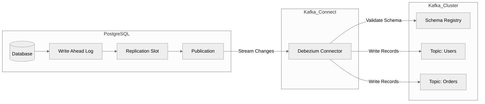

## Table of contents

# PostgreSQL 到 Kafka 实时数据流实践指南

> **基于 Confluent Developer 视频教程的深度总结**

本文档详细介绍了如何将 PostgreSQL 中的事务数据实时流式传输到 Kafka，涵盖了从理论基础、架构设计到实际部署配置的全过程。

## 1. 为什么需要数据流？ (The "Why")

在现代企业架构中，应用程序（如 POS 系统、交易网站）通常将状态持久化在事务型数据库（如 PostgreSQL）中。然而，这些数据对于企业其他部分同样至关重要：

1. **长期分析 (Analytics)** : 生成月度报告、商业智能 (BI) 仪表盘、或存入数据湖/数仓。
2. **近实时应用 (Near Real-time Apps)** : 后台计费系统、订单处理等。
3. **AI 与机器学习 (AI/ML)** : 特别是 RAG (检索增强生成) 应用，需要访问最新的实时数据以增强 LLM 的能力。
4. **跨团队决策** : 产品经理、UX 团队需要基于实时数据做出决策。

## 2. 数据提取方案对比 (The "How")

视频提出了评估数据提取方案的四个核心标准：

1. **开发简易性 (Easy to Write)**
2. **数据新鲜度 (Freshness)**
3. **部署复杂度 (Deployment)**
4. **Schema 变更检测 (Schema Drift)**

| **方案**                 | **描述**                                  | **缺点**                                                                   |
| ------------------------------ | ----------------------------------------------- | -------------------------------------------------------------------------------- |
| **SQL 轮询 (Polling)**   | 编写脚本定期运行 `SELECT *`                   | 数据延迟高（非实时）；需自行处理部署与监控；难以检测 Schema 变更（如列的增删）。 |
| **数据库备份 (Backups)** | 恢复备份到从库进行查询                          | 数据延迟极高（取决于备份频率）；部署复杂。                                       |
| **直接读取 WAL 日志**    | 解析数据库的 Write-Ahead Log                    | 二进制日志难以解析；需自行编写复杂的解析器；部署困难。                           |
| **Debezium (CDC)**       | **推荐方案** 。利用数据库的原生复制协议。 | **最佳选择** 。实时性高；Schema 自动检测；标准化部署。                     |

## 3. 核心架构：Debezium 与 Kafka Connect

**Debezium** 是基于 Kafka Connect 运行的开源 CDC (Change Data Capture) 平台。它监听数据库的变更日志，并将每一次 `INSERT`, `UPDATE`, `DELETE` 转换为 Kafka 消息。

### 3.1 架构图



### 3.2 关键组件解析

* **Change Data Capture (CDC)** :
* **INSERT** : 生成包含所有新字段值的消息 (`op: c`)。
* **UPDATE** : 生成包含更新前 (`before`) 和更新后 (`after`) 值的消息 (`op: u`)。
* **DELETE** : 生成包含被删除记录键值的消息 (`op: d`)。
* **Schema Registry** :
* Debezium 会将 Schema 注册到中心化的 Registry。
* 当下游消费者读取数据时，无需自行处理 Schema 变更逻辑，只需从 Registry 获取最新 Schema。
* 支持配置兼容性规则（如是否允许删除字段），防止破坏性变更。
* **PostgreSQL 侧配置** :
* **Replication Slot** : 确保 PostgreSQL 保留 Debezium 尚未读取的 WAL 日志，防止日志在读取前被清理。
* **Publication** : 定义哪些表的数据变更需要被发布。

## 4. 演示：配置与实战 (Demo Walkthrough)

### 4.1 环境准备

* **源端** : Amazon RDS PostgreSQL。
* **目的端** : Confluent Cloud (Kafka)。
* **连接器** : PostgreSQL CDC Source V2 Connector。

### 4.2 连接器配置步骤

1. **API Keys** : 生成 Kafka Cluster 的 API Key 用于连接器鉴权。
2. **数据库连接** :

* Host, Port, User, Password, Database Name。
* **SSL Mode** : 建议设置为 `require` 以保证安全。
* **网络白名单** : 必须在 AWS防火墙/安全组中放行 Kafka Connect 的静态 IP 地址。

1. **输出格式** :

* 推荐使用 `JSON_SR` (JSON with Schema Registry) 或 `Avro`。
* 设置 **Topic Prefix** (例如 `cdc_postgres_`)，所有生成的 Topic 将以该前缀命名。

1. **快照 (Snapshot)** :

* 建议开启 `Initial Snapshot`，首次启动时扫描全量历史数据。

### 4.3 `REPLICA IDENTITY` 的重要性

在 Demo 中出现了一个常见问题： **Update 操作没有 `before` 字段（即更新前的值为 null）** 。

* **原因** : PostgreSQL 默认只记录主键的变更。
* **解决** : 需要在数据库表上设置 `REPLICA IDENTITY` 为 `FULL`。

```sql
-- 开启全量日志记录，确保 Update 事件包含更新前的数据
ALTER TABLE my_table REPLICA IDENTITY FULL;
```

## 5. 高级特性：安全与扩展性

### 5.1 安全性 (Security)

* **字段脱敏 (Masking)** : 使用 Kafka Connect 的 SMT (Simple Message Transform) 功能，如 `MaskField`，在数据进入 Kafka 前将敏感字段（如 SSN、信用卡号）替换为 `****`。
* **客户端加密** : 对特定敏感字段进行加密，只有持有密钥的特定消费者才能解密。

### 5.2 扩展性 (Scalability)

Debezium 的扩展性受限于 PostgreSQL 的复制机制：

* **限制** : 1 个连接 = 1 个 Slot = 1 个 Publication。
* 这意味着对于同一个 Slot，`tasks.max` 只能为 **1** (即单线程读取)。

如何处理高吞吐量？

如果单线程无法跟上数据写入速度，需要进行分区 (Partitioning)：

1. **水平拆分** : 将大表的数据通过 `WHERE` 子句拆分到不同的 Publication 中。
2. **垂直拆分** : 将不同的列拆分到不同的 Publication。
3. **多连接器并行** : 部署多个 Connector，每个 Connector 监听不同的 Publication/Slot。

## 6. V1 vs V2 连接器

推荐使用  **V2 连接器** ，主要改进包括：

1. **性能提升** : 更高效的解析和传输。
2. **PostgreSQL 版本支持** : 支持更新的 PG 版本。
3. **增量快照 (Incremental Snapshots)** :

* V1 做初始快照时会锁表或长时间阻塞。
* V2 允许在处理实时流数据的同时，后台并发进行历史数据的快照，无需暂停业务。

1. **正则表达式支持** : 在选择表 (`table.include.list`) 时支持使用 Regex 匹配多个表。

## 7. 总结

将 PostgreSQL 数据流式传输到 Kafka 的最佳实践是使用  **Debezium V2 Connector** 。它解决了自行开发带来的 Schema 漂移、部署复杂和数据延迟问题，并提供了增量快照和 Schema Registry 集成等企业级功能。

### 附录：连接器配置示例 (JSON)

```json
{
  "name": "postgres-cdc-connector",
  "config": {
    "connector.class": "io.confluent.connectors.debezium.postgres.PostgresConnector",
    "tasks.max": "1",
    "database.hostname": "postgres-db.cluster-xxx.us-east-1.rds.amazonaws.com",
    "database.port": "5432",
    "database.user": "postgres",
    "database.password": "password",
    "database.dbname": "wizard_db",
    "database.server.name": "production_server",
    "table.include.list": "public.orders,public.users",
    "plugin.name": "pgoutput",
    "slot.name": "debezium_slot",
    "publication.name": "debezium_pub",
    "snapshot.mode": "initial",
    "key.converter": "org.apache.kafka.connect.json.JsonConverter",
    "value.converter": "org.apache.kafka.connect.json.JsonConverter",
    "transforms": "unwrap",
    "transforms.unwrap.type": "io.debezium.transforms.ExtractNewRecordState"
  }
}
```
