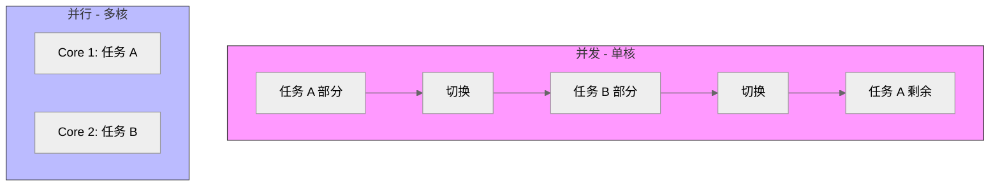
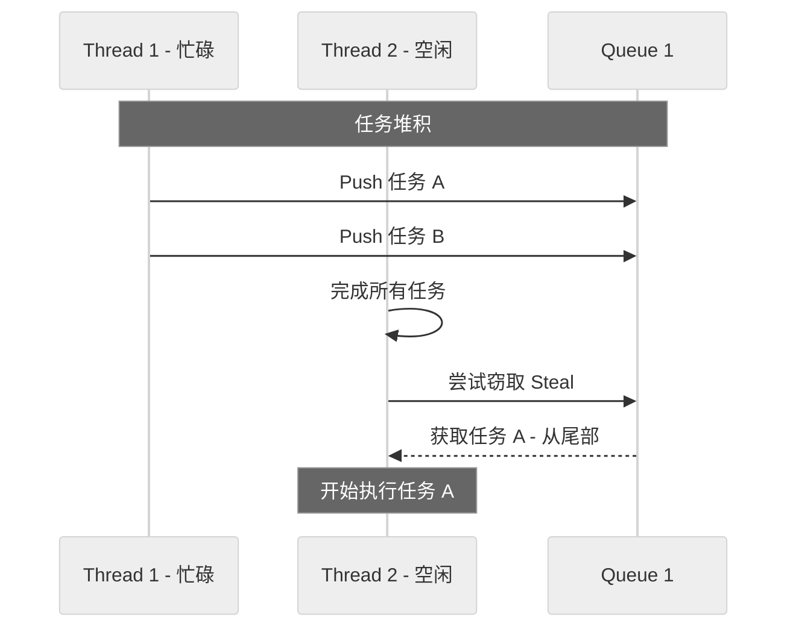

## Table of contents

# Rust 并行编程指南：追求极致性能

> **基于 Evgenii Seliverstov (Rust Nation UK 2025) 演讲内容的深度总结**

本文档详细拆解了 Rust 并行编程的各个层面，从高层的任务并行库到底层的硬件指令优化，旨在帮助开发者理解如何利用 Rust 构建“Blazingly Fast”的高性能应用。

## 1. 引言：Rust 与极致性能 (Introduction)

Rust 生态中涌现了大量性能卓越的工具（如 `uv` 替代 pip, `polars` 替代 pandas, `ruff` 替代 pylint），它们证明了 Rust 在构建高性能系统方面的潜力。这里的核心不仅是内存安全（Safety），更是如何通过零成本抽象实现极致速度。

### 并行计算的层级

并行可以在系统的不同层级被挖掘：

1. **硬件级 (Hardware)** : 指令流水线 (Pipelining)、超标量架构 (Superscalar)、SIMD (单指令多数据)。
2. **任务级 (Task)** : 操作系统线程、协程 (Green Threads, 如 Go/Java Virtual Threads)。
3. **系统级 (System)** : GPU 加速、分布式系统、消息传递接口 (MPI)。

## 2. 核心概念辨析 (Concepts)

在深入代码之前，必须厘清三个容易混淆的概念：

| **概念**                  | **定义**                                       | **关键特征**                                   |
| ------------------------------- | ---------------------------------------------------- | ---------------------------------------------------- |
| **并发 (Concurrency)**    | 在同一时间段内处理多个任务，通常通过上下文切换实现。 | **结构化** ：在单核 CPU 上通过时间片轮转模拟。 |
| **并行 (Parallelism)**    | 在同一时刻真正同时执行多个任务。                     | **物理级** ：必须依赖多核 CPU。                |
| **异步 (Asynchronicity)** | 任务之间的执行顺序不连续，通常用于 I/O 密集型场景。  | **非阻塞** ：与同步 (Sequential) 相对。        |



## 3. 高层任务并行：Rayon (Task-based Parallelism)

对于数据并行任务（Data Parallelism），**Rayon** 是 Rust 中的首选库。它将串行迭代器转换为并行迭代器，极大地降低了并行编程的门槛。

### 3.1 核心机制：工作窃取 (Work Stealing)

Rayon 不使用简单的 Fork-Join 模型，而是采用了动态平衡的 **工作窃取调度器** 。

* 每个线程都有自己的双端队列（Deque）。
* 当一个线程完成自己的任务后，它会从其他线程队列的 **尾部** “窃取”任务。
* **优势** ：减少线程空闲时间，自动处理负载不均衡，减少锁竞争。



### 3.2 代码模式

只需将 `iter()` 替换为 `par_iter()`：

```rust
use rayon::prelude::*;

fn main() {
    let data = vec![1, 2, 3, 4, 5];
  
    // 串行
    let sum_sq: i32 = data.iter().map(|&x| x * x).sum();
  
    // 并行 (只需修改一行)
    let sum_sq_par: i32 = data.par_iter().map(|&x| x * x).sum();
}
```

### 3.3 线程亲和性与 CPU Topology

* Rayon 默认根据逻辑 CPU 核心数创建线程池。
* **NUMA 架构** ：在多路 CPU 服务器上，跨 NUMA 节点访问内存会有延迟。简单的线程池可能导致线程在不同核心间迁移，引发缓存失效。
* **核心绑定 (Pinning)** ：可以使用 `core_affinity` crate 将线程绑定到特定核心，但在 Rust 中跨平台实现较为复杂（Linux/macOS 差异大）。

## 4. 性能分析与瓶颈识别 (Profiling & Bottlenecks)

即便使用了并行，程序也可能因为以下原因变慢：

1. **Amdahl 定律** ：受限于程序中必须串行执行的部分。
2. **同步开销** ：锁竞争 (Lock Contention)、消息传递开销。
3. **缓存一致性** ：多核之间的数据同步。

### 推荐工具链

* **Hyperfine** : 命令行基准测试工具，类似于加强版的 `time`。
* **Criterion** : Rust 内部微基准测试库，提供统计学显著的分析。
* **Perf & Flamegraphs** :
* Linux 下使用 `perf record` 采集数据。
* 使用 Rust 重写的工具 **Inferno** 生成火焰图，直观展示热点函数。
* **Perf Lock** : 专门分析锁竞争 (`perf lock record`)，查看哪些锁导致了线程阻塞。

## 5. 并发原语：共享状态 vs 消息传递 (Primitives)

Rust 提供了两种主要的并发模型：

### 5.1 共享状态 (Shared State)

* **Arc** : 原子引用计数，用于多线程间共享所有权。
* **Mutex** : 互斥锁。
* `std::sync::Mutex`: 基于操作系统原语 (pthread_mutex/futex)，较重。
* `parking_lot::Mutex`: 更轻量、基于自旋 (Spin) 优化，通常性能更好，且无 Poisoning 机制。
* **RwLock** : 读写锁，适合读多写少的场景。

### 5.2 消息传递 (Message Passing)

* **Channel** : 也就是 Go 语言中的 Channel 模式。
* `mpsc` (Multi-Producer, Single-Consumer): 标准库提供。
* **Bounded (有界)** : 提供背压 (Backpressure) 机制，防止生产者通过快撑爆内存。
* **Unbounded (无界)** : 无限缓冲，需谨慎使用。
* **Crossbeam** : 提供了更强大的并发数据结构（如 MPMC Channel, Deque, Lock-free map）。

## 6. 低级并行：原子操作与无锁编程 (Atomics & Lock-free)

当 `Mutex` 开销过大时，我们需要下潜到原子操作层面。

### 6.1 原子操作 (Atomics)

由 CPU 硬件指令支持（如 x86 的 `LOCK` 前缀指令）。

* **Load / Store** : 原子读写。
* **CAS (Compare-and-Swap)** : 无锁编程的基石。`compare_exchange`。

### 6.2 内存顺序 (Memory Ordering)

这是最复杂的部分，决定了编译器和 CPU 如何重排指令。

* `Relaxed`: 只保证原子性，不保证顺序。最快，但最危险。
* `Acquire / Release`: 建立“Happens-Before”关系，常用于互斥锁的实现。
* `SeqCst` (Sequential Consistency): 全局顺序一致，最慢但最符合直觉。**不要默认使用这个，除非你不知道该用什么。**

### 6.3 ABA 问题

在无锁数据结构（如栈）中，如果一个值从 A 变为 B 又变回 A，CAS 操作会认为它没变，但实际状态可能已改变（如内存已被释放）。需要配合 Epoch-based GC (Crossbeam 提供) 来解决。

## 7. 数据并行：SIMD (Data Parallelism)

单指令多数据 (SIMD) 允许 CPU 在一个时钟周期内处理多个数据点（如同时将 8 个整数相加）。

### 7.1 自动向量化 (Auto-Vectorization)

LLVM 编译器非常聪明，它会自动将简单的循环优化为 SIMD 指令。

* **提示** ：编写简单的、无依赖的循环，使用切片迭代器，避免复杂的控制流，帮助编译器进行优化。

### 7.2 手动 SIMD

当编译器无法自动优化时，可以使用：

1. **`std::arch` (Intrinsics)** :

* **不安全 (unsafe)** 。
* **平台特定** ：代码绑定到 x86_64 (AVX2, SSE) 或 ARM (NEON)。
* 需要使用 `#[cfg(target_arch = "...")]` 进行条件编译。

1. **`portable_simd` (Nightly)** :

* **安全 (Safe)** 。
* **跨平台** ：编写一次，在支持的硬件上自动映射到最佳指令集。
* 代码示例：

```rust
#![feature(portable_simd)]
use std::simd::f32x8;

fn add_arrays(a: &[f32], b: &[f32], c: &mut [f32]) {
    // 使用 f32x8 同时处理 8 个浮点数
    let (a_chunks, a_rem) = a.as_simd::<8>();
    let (b_chunks, b_rem) = b.as_simd::<8>();
    let (c_chunks, c_rem) = c.as_simd_mut::<8>();

    for ((x, y), z) in a_chunks.iter().zip(b_chunks).zip(c_chunks) {
        *z = *x + *y;
    }
    // ... 处理剩余部分 (Remainder)
}
```

### 7.3 运行时检测

不要编译带有 `-C target-cpu=native` 的代码分发给用户（可能导致非法指令崩溃）。应使用 `std::is_x86_feature_detected!("avx2")` 在运行时动态选择最佳实现。

## 8. 硬件亲和性与编译器优化 (Hardware & Compiler)

### 8.1 伪共享 (False Sharing)

如果两个线程频繁修改位于同一**缓存行 (Cache Line, 通常 64 字节)** 的不同变量，会导致 CPU 核心不断通过总线争抢缓存行的所有权，极大地降低性能。

* **解决方案** ：使用 `#[repr(align(64))]` 或 `crossbeam::utils::CachePadded` 填充数据结构，确保高频修改的变量独占缓存行。

### 8.2 编译器优化标志

* **LTO (Link Time Optimization)** : `lto = true`。允许跨 Crate 优化（如内联），减小体积并提高速度，但编译变慢。
* **Codegen Units** : `codegen-units = 1`。减少并行编译单元，允许 LLVM 进行全局分析，提升运行时性能。
* **Inline** : `#[inline]` (跨 Crate 内联) 和 `#[inline(always)]` (强制内联)。对热点小函数非常重要。

## 9. GPU 编程现状 (GPU Programming)

当 CPU 算力不足时，可以利用 GPU 的数千个核心。

* **现状** ：Rust 在 GPU 领域的生态尚未完全成熟。
* **wgpu** : 主要面向图形渲染，也可用于计算着色器 (Compute Shaders)，基于 WebGPU 标准。
* **Rust-CUDA** : 尝试直接用 Rust 编写 CUDA 内核，项目正在重启中。
* **当前最佳实践** : 通常仍需用 C++/CUDA 编写 Kernel，通过 Rust FFI 调用 Host Runtime。

## 总结 (Summary)

要获得“Blazing Speed”，建议遵循以下路径：

1. **从高层开始** ：优先使用 **Rayon** 和  **Crossbeam** 。
2. **避免共享状态** ：尽量使用消息传递或纯函数数据并行。
3. **拥抱 SIMD** ：先尝试让编译器自动优化，必要时使用 `portable_simd`。
4. **测量一切** ：不要盲目优化，使用 `perf` 和 `flamegraph` 找到真正的瓶颈。
5. **理解硬件** ：原子操作顺序、缓存行填充和 CPU 亲和性是通往极致性能的必经之路。
