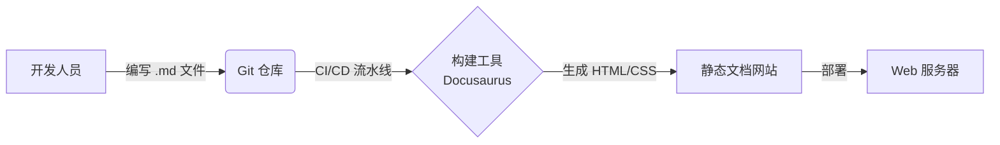
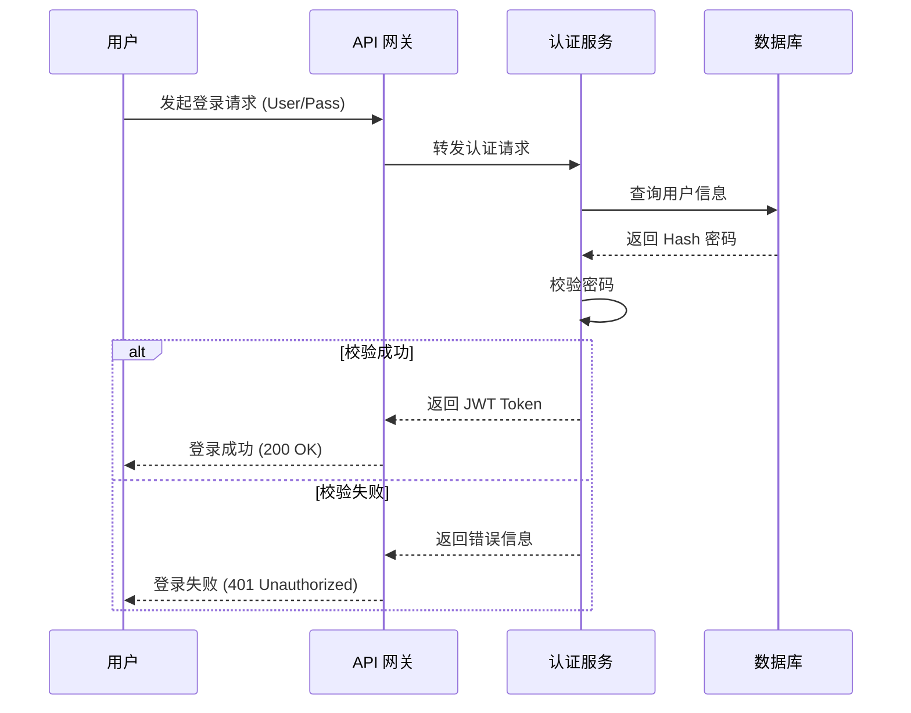

## Table of contents

# Design as Code (DaC) 实践指南

> **基于 Marcin Samsonowski (DevConf PL) 演讲内容的总结与技术指南**

本文档旨在介绍 "Design as Code" 的核心理念与实践方法。其核心思想是将软件设计制品（文档、图表、决策记录）视为代码，纳入版本控制系统（如 Git），与源代码同源管理。

## 1. 为什么选择 Design as Code?

在传统的 SDLC（软件开发生命周期）中，设计文档常常面临以下问题：

* **易过时** ：代码更新了，Wiki 或 Word 文档却没更新。
* **难追踪** ：难以通过 Diff 工具查看设计图的变更历史。
* **割裂感** ：文档位于 Confluence/SharePoint，代码位于 GitLab/GitHub，上下文切换成本高。

 **解决方案** ：将设计文档紧挨着代码存放，使用文本化的格式（Markdown, Mermaid, YAML 等）编写。

## 2. 核心实践一：文档即代码 (Docs as Code)

使用标记语言编写文档，并通过工具生成静态站点。

### 2.1 工具链

* **编写** ：Markdown (`.md`)
* **构建** ：Docusaurus, MkDocs, Hugo
* **存储** ：Git Repository (`/docs` 目录)

### 2.2 流程示例



## 3. 核心实践二：架构决策记录 (ADR)

不要只记录“是什么”，更要记录“为什么”。使用 ADR (Architecture Decision Records) 来固化决策上下文。

### 3.1 ADR 存储原则

* 存放在项目仓库的特定目录，如 `/docs/adr/`。
* ADR 是**不可变**的快照。如果决策变了，应创建一个新的 ADR 并标记旧的为 "Superseded"（已废弃）。

### 3.2 ADR 模板示例 (Markdown)

```markdown
# ADR-001: 使用 PostgreSQL 替代 MySQL

## 状态
Accepted (已接受)

## 日期
2025-12-04

## 背景 (Context)
我们需要一个能够处理复杂地理空间查询（Geospatial queries）的数据库。目前的 MySQL 5.7 在 PostGIS 等插件的支持上不如 PostgreSQL 成熟。

## 决策 (Decision)
我们决定在该项目中使用 PostgreSQL 15 作为主数据库。

## 后果 (Consequences)
* **正向**：原生的 PostGIS 支持将极大简化地理围栏功能的开发。
* **负向**：运维团队需要学习 PostgreSQL 的备份与调优知识，初期运维成本增加。
```

## 4. 核心实践三：图表即代码 (Diagrams as Code)

放弃二进制图片（.png, .vsd），使用基于文本的绘图工具。

### 4.1 推荐工具

* **Mermaid.js** ：语法简单，GitHub/GitLab 原生支持渲染。
* **PlantUML** ：功能强大，支持复杂的 UML。
* **Structurizr DSL** ：专门用于 C4 架构模型。

### 4.2 Mermaid 实战：业务流程图

**代码：**



## 5. 核心实践四：C4 架构模型

使用 **C4 模型** (Context, Containers, Components, Code) 来分层描述架构，避免一张图画所有东西导致混乱。

### 5.1 C4 层次图解

```mermaid
graph TD
    L1[Level 1: System Context<br/>系统全景图] --> L2[Level 2: Containers<br/>容器图 (服务/DB)]
    L2 --> L3[Level 3: Components<br/>组件图 (Controller/Service)]
    L3 --> L4[Level 4: Code<br/>类图 (通常忽略)]
  
    style L1 fill:#f9f,stroke:#333
    style L2 fill:#bbf,stroke:#333
    style L3 fill:#bfb,stroke:#333
    style L4 fill:#eee,stroke:#333,stroke-dasharray: 5 5
```

### 5.2 使用 Structurizr DSL 描述架构

Structurizr 允许你用代码定义模型和视图，而不是画图。

**伪代码示例：**

```structurizr
workspace {
    model {
        user = person "User"
        softwareSystem = softwareSystem "Software System" {
            webapp = container "Web Application"
            database = container "Database"
        }
        user -> webapp "Uses"
        webapp -> database "Reads/Writes"
    }
    views {
        systemContext softwareSystem {
            include *
            autolayout lr
        }
        container softwareSystem {
            include *
            autolayout lr
        }
    }
}
```

## 6. 总结

| **实践领域** | **传统方式** | **Design as Code 方式** | **优势**                   |
| ------------------ | ------------------ | ----------------------------- | -------------------------------- |
| **文档**     | Word / Wiki        | Markdown + Git                | 版本控制，易于评审               |
| **图表**     | Visio / Draw.io    | Mermaid / PlantUML            | 可通过 Diff 查看变更，自动化生成 |
| **决策**     | 邮件 / 会议记录    | ADR (Markdown)                | 固化上下文，有迹可循             |
| **架构**     | 随意画框图         | C4 Model + Structurizr        | 结构化，分层清晰                 |

通过采用 Design as Code，我们不仅提高了文档的维护性，更重要的是将设计工作融入了开发者的日常工作流中，确保了设计与实现的同步。
