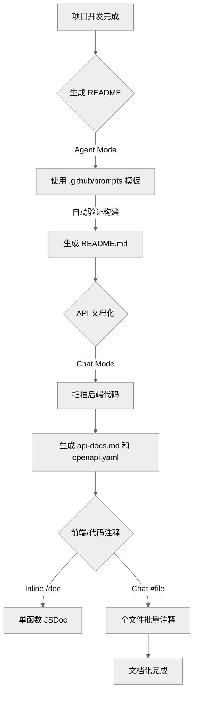

## Table of contents

## 概述

基于 Microsoft Visual Studio Code 团队 Maxin Soniggov 的演示视频总结。

**视频来源**: [Advanced Techniques for Documenting Code with GitHub Copilot](https://www.youtube.com/watch?v=example)

本文档详细介绍了如何利用 GitHub Copilot 将代码文档编写从一项繁琐的任务转变为快速、准确且自动化的流程。我们将通过一个个人开支追踪应用（Personal Expense Tracker）项目,演示从生成 README 到 API 文档再到前端注释的全过程。

## 1. 项目背景与准备 (Introduction)

在开发个人项目或企业应用时,开发者往往专注于代码实现（Product Requirements -> Tech Spec -> Implementation）,而忽略了文档编写。

- **演示项目**: 一个简单的个人开支追踪应用（Expense Tracker）。
- **当前状态**: 功能已实现,但完全缺乏文档。
- **目标**: 使用 GitHub Copilot 自动生成 README、API 文档和代码注释。

## 2. 自动化生成 README.md (Generating README)

一个好的项目始于一个好的 README 文件。与其手动编写,我们可以使用预定义的提示词模板。

### 2.1 提示词复用技巧

视频中展示了一个高效的技巧：利用 `.github/prompts` 目录复用提示词。

- **资源来源**: awesome-copilot 仓库包含了大量社区贡献的提示词。
- **配置方法**:
  1. 下载 `readme-generator.prompt.md`（或其他提示词文件）。
  2. 将其放入项目的 `.github/prompts/` 目录下。
- **效果**: 在 Copilot Chat 中,该文件将作为一个斜杠命令（Slash Command）直接可用。

### 2.2 执行生成

- **操作**: 在 Copilot Chat (Agent Mode) 中输入自定义命令（例如调用刚才保存的 prompt）。
- **优势**: Copilot Agent 模式不仅会生成文本,还会运行终端命令（如构建命令）来验证项目的构建步骤是否正确,从而确保 README 中的安装/运行指南是准确可用的。

```markdown
# 示例操作流程
1. 打开 Copilot Chat
2. 输入自定义命令 (基于 .github/prompts 中的文件)
3. Copilot 分析代码结构 -> 尝试运行构建命令 -> 生成 README.md
```

## 3. 后端 API 文档化 (Documenting the API)

README 通常只包含概览,对于 API 层,我们需要更详细的技术文档。

### 3.1 目标

生成两份文档：

- **人类可读文档**: 详细描述 API 端点功能。
- **OpenAPI 规范 (YAML)**: 用于机器处理和 Swagger UI 展示。

### 3.2 使用 Edit Mode (编辑模式)

对于创建新文件,推荐使用 Copilot 的 Edit Mode（通常是开启一个新的 Chat 会话或使用内联 Chat）,因为不需要执行终端命令。

**提示词 (Prompt)**:
```text
"Create detailed API [documentation] and following best practices"
(创建详细的 API 文档并遵循最佳实践)
```

**结果**:
- Copilot 扫描后端代码（Controller/Routes）。
- 自动生成了 `api-docs.md`（人类可读）和 `openapi.yaml`（符合规范的 YAML 文件）。

## 4. 自带模型密钥 (Bring Your Own Key - BYOK)

视频中插播介绍了一个重要的新功能,增强了 Copilot 的灵活性。

### 4.1 功能介绍

开发者现在可以在 GitHub Copilot 中配置和使用第三方 AI 模型（如 Google Gemini, Anthropic Claude 等）,而不仅限于默认模型。

### 4.2 适用场景

- **合规性**: 某些组织要求使用特定的模型或数据处理协议。
- **成本控制**: 管理不同模型的调用成本。
- **灵活性**: 针对特定任务选择表现更好的模型。

### 4.3 操作演示

1. 打开 Copilot Chat 的模型选择器。
2. 选择 "Manage Models" 或直接选择已配置的第三方模型（如 Gemini）。
3. 输入 API Key 进行连接。
4. 之后的交互将通过该 API Key 和选定的模型进行。

## 5. 前端代码注释 (Frontend Documentation)

对于具体的前端组件代码（如 React/TypeScript 组件）,我们需要生成 JSDoc 或函数注释。

### 5.1 技巧一：Inline Mode (内联模式)

适用于快速为单个方法生成文档。

**操作**:
1. 选中代码或将光标放在方法上方。
2. 按下快捷键（Windows: `Ctrl+I`, Mac: `Cmd+I`）。
3. 输入命令: `/doc`。

**结果**: Copilot 自动生成标准的 JSDoc 注释,解释参数、返回值和函数用途。

### 5.2 技巧二：批量文件文档化

适用于一次性为整个文件补充缺失的文档。

**操作**:
1. 打开 Chat 窗口。
2. 输入提示词:
   ```text
   "Add inline return to all methods in #file:dashboard.tsx"
   (为 dashboard.tsx 文件中的所有方法添加内联返回注释)
   ```
3. 使用 `#file` 上下文变量精准定位文件。

**结果**: Copilot 会重写该文件,为每一个方法添加规范的注释块。

## 6. 总结工作流 (Workflow Summary)

整个文档编写流程可以总结为以下自动化路径：



## 关键收获 (Key Takeaways)

1. **Prompt as Code**: 将常用的文档生成提示词存入 `.github/prompts`,像代码一样管理和复用。

2. **Agent Mode 验证**: 生成安装文档时,利用 Agent 模式运行命令来验证文档的准确性。

3. **多模式结合**:
   - Readme -> Agent Mode
   - 新文件/API -> Edit Mode / Chat
   - 函数注释 -> Inline Mode (`/doc`)

4. **模型灵活性**: 利用 BYOK 功能根据需求切换底层 AI 模型。

通过这套流程,开发者可以从繁重的文档编写中解脱出来,同时保证文档的及时性和准确性。
