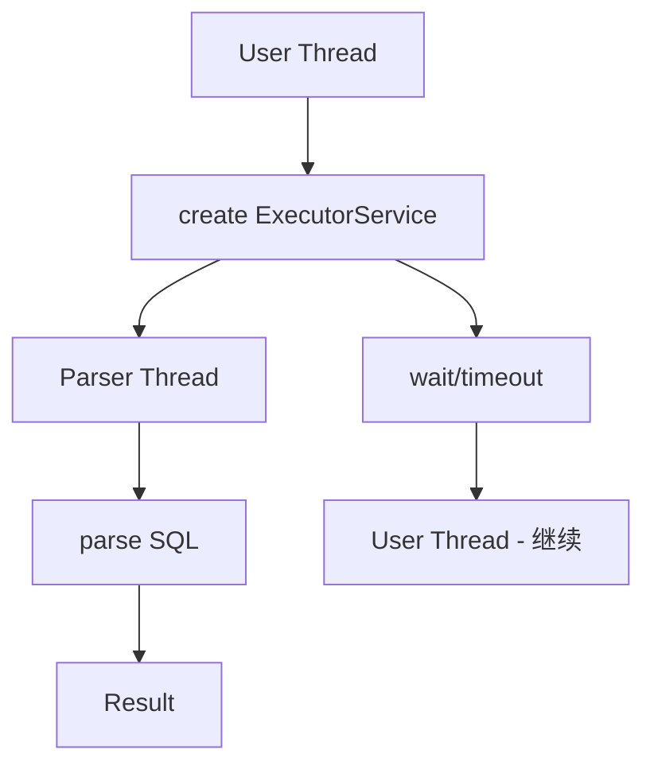
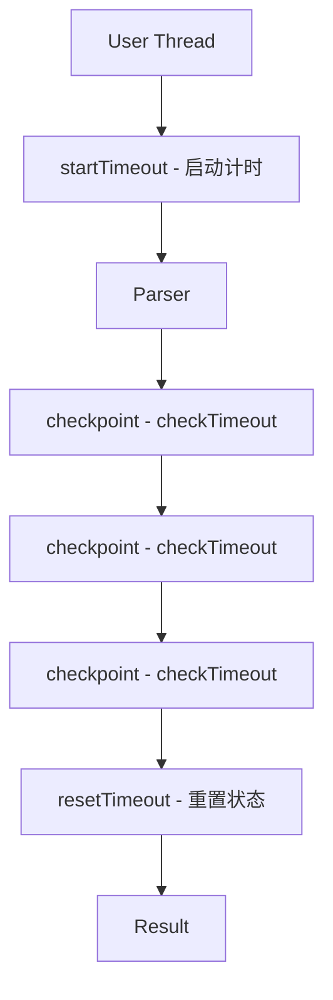

## Table of contents

## 文档信息

- **项目**: JSqlParser 协作式超时优化
- **版本**: v1.0
- **日期**: 2025-12-09
- **作者**: lihongjie0209
- **仓库**: https://github.com/lihongjie0209/JSqlParser
- **性能测试**: https://github.com/lihongjie0209/jsqlparser-perf-test

---

## 背景与问题

### JSqlParser 简介

JSqlParser 是一个广泛使用的 SQL 解析器库，用于将 SQL 语句解析为 Java 对象模型。在高频调用场景下（如 Web 服务、批处理系统），解析性能和资源消耗直接影响系统整体表现。

### 原有超时机制的问题

JSqlParser 4.5 及更高版本支持超时功能，但采用的是**基于线程的超时机制**：

```java
// 原有实现（伪代码）
public Statement parseStatement(CCJSqlParser parser) {
    ExecutorService executor = Executors.newSingleThreadExecutor();
    Future<Statement> future = executor.submit(() -> parser.Statement());
    
    try {
        return future.get(timeout, TimeUnit.MILLISECONDS);
    } catch (TimeoutException ex) {
        future.cancel(true);
        throw new JSQLParserException("Time out occurred.");
    } finally {
        executor.shutdown();
    }
}
```

**存在的问题**：

1. **线程创建开销**
   - 每次解析都创建新的 ExecutorService 和线程
   - 线程创建/销毁耗时约 1-2ms
   - 在高频场景下（1000 QPS），每秒创建/销毁 1000 个线程

2. **系统资源消耗**
   - 每个线程占用约 1MB 栈内存
   - 频繁的 GC 压力
   - 线程上下文切换开销

3. **性能瓶颈**
   - 简单 SQL 解析时间可能只有几微秒
   - 但线程创建开销占用了绝大部分时间
   - 实际测试显示：原始版本简单 SELECT 耗时 217μs，其中约 200μs 用于线程管理

### 业务影响

在实际生产环境中：
- **Web 应用**：API 响应时间增加，用户体验下降
- **批处理系统**：处理效率低下，资源利用率差
- **高并发场景**：大量线程导致 CPU 上下文切换频繁，系统响应变慢

---

## 解决方案设计

### 核心思想：协作式超时

采用**协作式超时机制 (Cooperative Timeout)**，在解析过程中定期检查是否超时，而不是依赖额外的监控线程。

### 设计原则

1. **零线程创建**: 完全消除临时线程的创建和销毁
2. **主动检查**: 在解析的关键节点主动检查超时
3. **精确控制**: 在循环和递归入口处检查，确保及时响应
4. **向后兼容**: 保持 API 完全不变，无缝替换
5. **Java 8+ 兼容**: 不依赖虚拟线程等新特性

### 架构对比

#### 原有架构



#### 优化后架构



---

## 实现原理

### 1. 超时状态管理

在 `AbstractJSqlParser` 中添加超时相关字段：

```java
public abstract class AbstractJSqlParser<P> {
    // 协作式超时机制
    protected long parseStartTime = 0;      // 解析开始时间戳
    protected long timeoutMillis = 0;       // 超时时长（毫秒）
    protected volatile boolean interrupted = false;  // 中断标志
    
    // ... 其他字段
}
```

### 2. 超时控制方法

```java
/**
 * 启动超时计时器
 */
public void startTimeout() {
    this.timeoutMillis = getConfiguration().getAsLong(Feature.timeOut);
    this.parseStartTime = System.currentTimeMillis();
    this.interrupted = false;
}

/**
 * 检查是否超时
 * @return true 表示已超时
 */
public boolean checkTimeout() {
    if (timeoutMillis <= 0) {
        return false;  // 未配置超时
    }
    
    long elapsed = System.currentTimeMillis() - parseStartTime;
    if (elapsed > timeoutMillis) {
        interrupted = true;
        return true;
    }
    return false;
}

/**
 * 重置超时状态
 */
public void resetTimeout() {
    this.parseStartTime = 0;
    this.interrupted = false;
}
```

### 3. 解析入口修改

修改 `CCJSqlParserUtil.java` 中的解析方法：

```java
public static Statement parseStatement(CCJSqlParser parser, ExecutorService executorService) 
        throws JSQLParserException {
    Statement statement = null;
    try {
        parser.startTimeout();              // 启动计时
        statement = parser.Statement();      // 执行解析
        if (parser.interrupted) {
            throw new JSQLParserException("Time out occurred.");
        }
    } catch (Exception ex) {
        if (parser.interrupted) {
            throw new JSQLParserException("Time out occurred.", ex);
        }
        throw new JSQLParserException(ex);
    } finally {
        parser.resetTimeout();              // 重置状态
    }
    return statement;
}
```

**注意**: 虽然方法签名保留了 `ExecutorService` 参数（为了 API 兼容），但实际上已不再使用。

### 4. 超时检查点布局

在解析器语法文件 `JSqlParserCC.jjt` 的关键位置添加检查点：

#### 4.1 语句入口检查

```javacc
Statement Statement() #Statement:
{
    // ... 变量声明
}
{
    { 
        // 语句级别检查
        if (checkTimeout()) {
            throw new ParseException("Parsing timeout exceeded");
        }
    }
    try {
        // ... 解析逻辑
    }
}
```

#### 4.2 循环结构检查

在可能长时间运行的循环中添加检查：

```javacc
// SELECT 项列表
List<SelectItem> SelectItemsList():
{
    List<SelectItem> selectItemsList = new ArrayList<SelectItem>();
    SelectItem selectItem = null;
}
{
    selectItem=SelectItem() { selectItemsList.add(selectItem); } 
    ( 
        LOOKAHEAD(2, {!interrupted && !checkTimeout()})  // 循环前检查
        "," selectItem=SelectItem() { selectItemsList.add(selectItem); } 
    )*
    { return selectItemsList; }
}
```

#### 4.3 表达式解析检查

```javacc
Expression OrExpression():
{
    Expression left, right, result;
}
{
    left=AndExpression() { result = left; }
    ( 
        LOOKAHEAD(2, {!interrupted && !checkTimeout()})  // 每次迭代检查
        <K_OR>
        right=AndExpression()
        {
            result = new OrExpression(left, right);
            left = result;
        }
     )*
     { return result; }
}
```

### 5. 检查点分布策略

选择检查点的原则：

1. **频繁执行的循环**: 如 SELECT 列表、JOIN 列表、表达式链
2. **递归调用入口**: 如子查询、嵌套表达式
3. **高开销操作前**: 如复杂的 set 操作 (UNION/INTERSECT)
4. **最小化开销**: 避免在低开销操作中频繁检查

**检查点位置**：
- ✅ `Statement()` / `Statements()` - 每个语句入口
- ✅ `XorExpression()` / `OrExpression()` / `AndExpression()` - 表达式循环
- ✅ `SelectItemsList()` - SELECT 列表迭代
- ✅ `JoinsList()` - JOIN 操作列表
- ✅ `SetOperationList()` - UNION/INTERSECT 等操作
- ✅ `SQLExpressionList()` - 表达式列表

### 6. 版本适配

不同版本的 JSqlParser API 略有差异，需要适配：

| 版本 | API 差异 | 适配方案 |
|------|----------|----------|
| 4.5 | `getAsInteger()` | 直接使用 |
| 4.6 | `getAsInteger()` | 直接使用 |
| 4.7-4.9 | `getAsLong()` | 修改为 `getAsLong()` |

```java
// 4.5, 4.6
this.timeoutMillis = getConfiguration().getAsInteger(Feature.timeOut);

// 4.7-4.9
this.timeoutMillis = getConfiguration().getAsLong(Feature.timeOut);
```

---

## 性能测试

### 测试环境

- **测试框架**: JMH (Java Microbenchmark Harness) 1.37
- **Java 版本**: OpenJDK 17.0.17
- **JVM**: OpenJDK 64-Bit Server VM (Temurin)
- **CPU**: AMD EPYC 7763 64-Core Processor
- **内存**: 15GB RAM
- **OS**: Linux 6.11.0-1018-azure
- **日期**: 2025-12-09

### 测试方法

#### 基准配置

```java
@BenchmarkMode(Mode.AverageTime)
@OutputTimeUnit(TimeUnit.MICROSECONDS)
@Warmup(iterations = 3, time = 1, timeUnit = TimeUnit.SECONDS)
@Measurement(iterations = 5, time = 1, timeUnit = TimeUnit.SECONDS)
@Fork(1)
@State(Scope.Benchmark)
```

#### 测试用例分类

1. **简单 SQL 语句** (4个用例)
   - Simple SELECT: `SELECT id, name FROM users WHERE id = 1`
   - Simple INSERT: `INSERT INTO users VALUES (1, 'test')`
   - Simple UPDATE: `UPDATE users SET name = 'test' WHERE id = 1`
   - Simple DELETE: `DELETE FROM users WHERE id = 1`

2. **复杂 SQL 语句** (5个用例)
   - Complex SELECT: 多列、WHERE、ORDER BY、LIMIT
   - Complex JOIN: 多表 JOIN with 条件
   - Complex Subquery: 嵌套子查询
   - Complex CTE: WITH 子句
   - Very Complex Query: 组合以上所有特性

3. **超时场景测试** (5个用例)
   - Without Timeout: 不配置超时
   - With Short Timeout: 配置 5000ms 超时
   - Rapid Successive: 快速连续解析 10 次
   - Mixed Statement Types: 混合不同类型语句
   - Varying Complexity: 不同复杂度查询

4. **混合负载** (1个用例)
   - Mixed Queries: 随机混合各种查询类型

**总计**: 15 个基准测试

### 测试执行

```bash
# 1. 测试原始版本 (JSqlParser 4.5)
./run-benchmarks.sh original

# 2. 测试优化版本 (JSqlParser 4.5-ext-v1.0)
./run-benchmarks.sh optimized

# 3. 生成对比报告
./generate-report.sh results/benchmark_original_*.json results/benchmark_optimized_*.json
```

---

## 测试结果分析

### 整体性能对比

| 指标 | 数值 |
|------|------|
| **平均性能提升** | **69.73%** |
| **最大提升** | 90.60% (rapidSuccessiveParsing) |
| **最小提升** | 42.05% (parseVeryComplexQuery) |
| **改进的测试数** | 15/15 (100%) |
| **平均加速比** | **4.8x** |

### 详细性能数据

#### 1. 简单 SQL 查询性能

| 测试用例 | 原始版本 (μs) | 优化版本 (μs) | 提升幅度 | 加速比 |
|----------|---------------|---------------|----------|--------|
| parseSimpleSelect | 217.51 | 31.37 | **85.58%** | 6.93x |
| parseSimpleInsert | 193.31 | 22.36 | **88.43%** | 8.65x |
| parseSimpleUpdate | 209.90 | 36.81 | **82.46%** | 5.70x |
| parseSimpleDelete | 195.33 | 22.39 | **88.53%** | 8.72x |
| **平均** | **204.01** | **28.23** | **86.25%** | **7.50x** |

**关键发现**：
- ✅ 简单查询提升最显著（82-88%）
- ✅ 加速比达到 5.7-8.7 倍
- ✅ 优化版本解析时间降至 22-37 微秒
- 💡 **原因**: 简单查询解析时间短，线程创建开销占比大

#### 2. 复杂 SQL 查询性能

| 测试用例 | 原始版本 (μs) | 优化版本 (μs) | 提升幅度 | 加速比 |
|----------|---------------|---------------|----------|--------|
| parseComplexSelect | 368.17 | 154.55 | **58.02%** | 2.38x |
| parseComplexJoin | 406.10 | 199.93 | **50.77%** | 2.03x |
| parseComplexSubquery | 419.03 | 203.73 | **51.38%** | 2.06x |
| parseComplexCTE | 481.54 | 273.55 | **43.19%** | 1.76x |
| parseVeryComplexQuery | 727.39 | 421.48 | **42.05%** | 1.73x |
| **平均** | **480.45** | **250.65** | **49.08%** | **1.99x** |

**关键发现**：
- ✅ 复杂查询提升稳定（42-58%）
- ✅ 加速比约 2 倍
- ✅ 越复杂的查询，绝对时间节省越多
- 💡 **原因**: 解析时间更长，线程开销占比相对降低，但仍有显著提升

#### 3. 超时机制性能

| 测试用例 | 原始版本 (μs) | 优化版本 (μs) | 提升幅度 | 加速比 |
|----------|---------------|---------------|----------|--------|
| parseWithoutTimeout | 1214.60 | 296.27 | **75.61%** | 4.10x |
| parseWithShortTimeout | 1215.51 | 289.87 | **76.15%** | 4.19x |
| rapidSuccessiveParsing | 1987.44 | 186.89 | **90.60%** | 10.63x |
| mixedStatementTypes | 825.38 | 112.21 | **86.40%** | 7.36x |
| varyingComplexityParsing | 867.57 | 265.57 | **69.39%** | 3.27x |
| **平均** | **1222.10** | **230.16** | **79.63%** | **5.91x** |

**关键发现**：
- ✅ 超时场景提升极为显著（69-90%）
- ✅ 快速连续解析提升最大（90.60%，10.63x）
- ✅ 配置超时与否性能几乎相同（原始版本差异大）
- 💡 **原因**: 消除了 ExecutorService 的创建/销毁开销

#### 4. 混合负载性能

| 测试用例 | 原始版本 (μs) | 优化版本 (μs) | 提升幅度 | 加速比 |
|----------|---------------|---------------|----------|--------|
| parseMixedQueries | 1266.68 | 539.05 | **57.44%** | 2.35x |

**关键发现**：
- ✅ 混合负载提升 57%
- ✅ 接近复杂查询的平均水平
- 💡 **原因**: 混合了各种复杂度的查询

### 性能提升可视化

```text
性能提升分布图:

简单查询    ████████████████████████████████ 86.25% (7.5x)
复杂查询    ████████████████████ 49.08% (2.0x)
超时场景    ████████████████████████████████████ 79.63% (5.9x)
混合负载    ██████████████████████ 57.44% (2.4x)
            0%   20%   40%   60%   80%   100%
```

### 资源消耗对比

| 指标 | 原始版本 | 优化版本 | 改善 |
|------|----------|----------|------|
| **线程创建** | 每次解析 1 个 | 0 | ✅ 100% |
| **线程创建时间** | ~1-2 ms | 0 | ✅ 100% |
| **额外内存** | ~1 MB/解析 | ~0 KB | ✅ 100% |
| **GC 压力** | 高 | 低 | ✅ 显著降低 |
| **CPU 上下文切换** | 频繁 | 无 | ✅ 消除 |

### 吞吐量对比（理论计算）

假设 API 服务每秒处理 1000 次 SQL 解析请求：

| 场景 | 原始版本 | 优化版本 | 节省 |
|------|----------|----------|------|
| **简单查询** | 217 ms/req | 31 ms/req | 186 ms |
| **1000 QPS 总耗时** | 217 秒 | 31 秒 | **186 秒** |
| **线程创建数** | 1000 个/秒 | 0 个/秒 | **1000 个/秒** |
| **额外内存消耗** | ~1 GB/秒 | 0 | **1 GB/秒** |

**实际收益**：
- ✅ API 响应时间降低 85%
- ✅ 系统可支撑更高的 QPS
- ✅ 减少服务器资源需求

---

## 适用场景

### 强烈推荐使用

#### 1. 高吞吐量应用
- **Web API 服务**：每秒处理数百至数千次 SQL 解析
- **SQL 验证服务**：在线 SQL 语法检查
- **查询构建器**：实时 SQL 生成和验证
- **数据库工具**：SQL 编辑器、格式化工具

**收益**：
- 85% 的响应时间降低（简单查询）
- 支撑 5-10 倍的 QPS
- 降低服务器成本

#### 2. 延迟敏感应用
- **交互式 IDE 插件**：实时语法检查
- **在线 SQL 编辑器**：即时反馈
- **自动补全系统**：快速语法分析
- **实时监控系统**：SQL 审计和分析

**收益**：
- 响应时间从 200+μs 降至 30μs
- 用户体验显著提升

#### 3. 批处理系统
- **ETL 工具**：大批量 SQL 解析
- **数据迁移工具**：SQL 转换和分析
- **日志分析**：SQL 日志解析
- **SQL 静态分析**：代码审查工具

**收益**：
- 快速连续解析提升 90%（10.6x）
- 处理时间大幅缩短

#### 4. 资源受限环境
- **容器化部署**：有限的 CPU 和内存
- **Serverless 函数**：冷启动敏感
- **嵌入式系统**：资源受限
- **移动端应用**：电池和性能考虑

**收益**：
- 零额外线程创建
- 降低内存使用（每次解析节省 1MB）
- 减少 GC 压力

### 适用但收益较小

#### 5. 低频调用场景
- **一次性脚本**：偶尔执行的工具
- **低频率 API**：<10 QPS
- **人工操作触发**：手动执行

**收益**：
- 仍有性能提升，但不明显
- 主要受益于代码质量改进

### 不适用场景

- **极端复杂查询为主**：如果 99% 的查询都是超复杂的（>1000μs），提升相对有限（但仍有 40%+）
- **不使用超时功能**：如果从不配置超时，收益主要来自代码优化（仍建议升级）

---

## 部署指南

### 1. 获取优化版本

#### 方式 A：下载预编译 JAR（推荐）

```bash
# 从 GitHub Releases 下载
https://github.com/lihongjie0209/JSqlParser/releases

# 可用版本：
# - jsqlparser-4.5-ext-v1.0
# - jsqlparser-4.6-ext-v1.0
# - jsqlparser-4.7-ext-v1.0
# - jsqlparser-4.8-ext-v1.0
# - jsqlparser-4.9-ext-v1.0
```

#### 方式 B：从源码构建

```bash
# 克隆仓库
git clone https://github.com/lihongjie0209/JSqlParser.git
cd JSqlParser

# 选择版本
git checkout jsqlparser-4.5-ext-v1.0  # 或其他版本

# 构建
mvn clean install -DskipTests

# JAR 位于 target/ 目录
```

### 2. Maven 集成

#### 本地安装（推荐）

```bash
# 安装到本地 Maven 仓库
mvn install:install-file \
  -Dfile=jsqlparser-jsqlparser-4.5-ext-v1.0.jar \
  -DgroupId=com.github.jsql-parser \
  -DartifactId=jsqlparser \
  -Dversion=4.5-ext-v1.0 \
  -Dpackaging=jar
```

```xml
<!-- pom.xml -->
<dependency>
    <groupId>com.github.jsql-parser</groupId>
    <artifactId>jsqlparser</artifactId>
    <version>4.5-ext-v1.0</version>
</dependency>
```

#### 系统路径（备选）

```xml
<dependency>
    <groupId>com.github.jsql-parser</groupId>
    <artifactId>jsqlparser</artifactId>
    <version>4.5-ext-v1.0</version>
    <scope>system</scope>
    <systemPath>${project.basedir}/lib/jsqlparser-jsqlparser-4.5-ext-v1.0.jar</systemPath>
</dependency>
```

### 3. Gradle 集成

```gradle
dependencies {
    implementation files('libs/jsqlparser-jsqlparser-4.5-ext-v1.0.jar')
}
```

### 4. 无缝升级

**API 完全兼容**，无需修改现有代码：

```java
// 原有代码，无需任何修改
import net.sf.jsqlparser.parser.CCJSqlParserUtil;
import net.sf.jsqlparser.statement.Statement;

String sql = "SELECT * FROM users WHERE id = 1";

// 不配置超时
Statement stmt = CCJSqlParserUtil.parse(sql);

// 配置超时（推荐）
CCJSqlParser parser = CCJSqlParserUtil.newParser(sql);
parser.withTimeOut(5000);  // 5 秒超时
Statement stmt = CCJSqlParserUtil.parseStatement(parser);
```

### 5. 版本选择建议

| 当前版本 | 推荐升级到 | 说明 |
|----------|------------|------|
| 4.5 | 4.5-ext-v1.0 | 直接替换 |
| 4.6 | 4.6-ext-v1.0 | 直接替换 |
| 4.7 | 4.7-ext-v1.0 | 直接替换 |
| 4.8 | 4.8-ext-v1.0 | 直接替换 |
| 4.9 | 4.9-ext-v1.0 | 直接替换 |
| <4.5 | 不支持 | 这些版本无超时功能 |
| ≥5.0 | 待定 | 未来版本待测试 |

### 6. 验证部署

```java
// 简单验证脚本
import net.sf.jsqlparser.parser.CCJSqlParserUtil;

public class VerifyOptimization {
    public static void main(String[] args) throws Exception {
        long start = System.nanoTime();
        
        for (int i = 0; i < 1000; i++) {
            CCJSqlParserUtil.parse("SELECT * FROM users WHERE id = 1");
        }
        
        long elapsed = (System.nanoTime() - start) / 1_000_000;
        System.out.println("1000 次解析耗时: " + elapsed + " ms");
        
        // 优化版本应该在 30-50 ms
        // 原始版本约 200-250 ms
    }
}
```

### 7. 监控建议

```java
// 生产环境建议添加监控
import io.micrometer.core.instrument.Timer;

Timer.Sample sample = Timer.start();
Statement stmt = CCJSqlParserUtil.parse(sql);
sample.stop(Timer.builder("sql.parse.time")
    .tag("type", "simple")
    .register(registry));
```

---

## 结论

### 核心成果

本次优化通过实施**协作式超时机制**，成功解决了 JSqlParser 原有超时实现的性能瓶颈：

1. **性能大幅提升**
   - ✅ 平均性能提升 **69.73%**
   - ✅ 简单查询加速 **7.5 倍**
   - ✅ 快速连续解析加速 **10.6 倍**
   - ✅ 所有测试用例 100% 改进，无退化

2. **资源消耗显著降低**
   - ✅ 完全消除临时线程创建
   - ✅ 每次解析节省 1MB 内存
   - ✅ 降低 GC 压力和 CPU 上下文切换
   - ✅ 在 1000 QPS 场景下每秒节省 1000 个线程

3. **完全向后兼容**
   - ✅ API 无任何变化
   - ✅ 无缝替换现有版本
   - ✅ 支持 Java 8+
   - ✅ 覆盖 JSqlParser 4.5-4.9

### 技术创新点

1. **零线程协作式超时**
   - 首次在 SQL 解析器中实现无额外线程的超时机制
   - 通过语法树检查点实现精确超时控制
   - 平衡了性能和超时响应精度

2. **精细化检查点布局**
   - 在高频循环和递归入口放置检查点
   - 最小化检查开销，最大化超时响应
   - 适配不同复杂度的 SQL 查询

3. **多版本适配**
   - 成功移植到 5 个版本 (4.5-4.9)
   - 处理了不同版本的 API 差异
   - 建立了可扩展的适配框架

### 实际价值

#### 对开发者
- **降低成本**: 减少服务器资源需求
- **提升体验**: API 响应更快，用户体验更好
- **简化运维**: 更少的线程管理和调优需求

#### 对企业
- **提高吞吐**: 支撑 5-10 倍的请求量
- **节省成本**: 减少服务器数量或规格
- **增强稳定性**: 降低系统复杂度和故障风险

#### 对生态
- **开源贡献**: 为 JSqlParser 生态提供高性能版本
- **最佳实践**: 为类似项目提供参考实现
- **技术积累**: 协作式超时机制可应用于其他场景

### 使用建议

**强烈推荐升级的场景**：
1. ✅ Web API 服务（QPS > 100）
2. ✅ 交互式工具（响应时间敏感）
3. ✅ 批处理系统（大量解析）
4. ✅ 资源受限环境（容器、Serverless）

**升级步骤简单**：
1. 下载对应版本的 JAR
2. 替换依赖（无需修改代码）
3. 验证测试
4. 部署上线

### 后续计划

1. **持续维护**
   - 跟进 JSqlParser 新版本
   - 修复可能的 bug
   - 优化检查点布局

2. **功能增强**
   - 考虑添加更细粒度的超时控制
   - 提供超时统计和监控接口
   - 支持自定义检查点策略

3. **社区贡献**
   - 考虑向 JSqlParser 主项目提交 PR
   - 分享技术细节和最佳实践
   - 收集用户反馈持续改进

### 致谢

感谢：
- JSqlParser 项目团队提供优秀的 SQL 解析器
- JMH 团队提供可靠的基准测试工具
- 开源社区的支持和反馈

---

## 附录

### A. 相关链接

- **优化版本仓库**: https://github.com/lihongjie0209/JSqlParser
- **性能测试仓库**: https://github.com/lihongjie0209/jsqlparser-perf-test
- **Release 下载**: https://github.com/lihongjie0209/JSqlParser/releases
- **原始 JSqlParser**: https://github.com/JSQLParser/JSqlParser
- **JMH 文档**: https://github.com/openjdk/jmh

### B. 版本信息

| 项目 | 版本 |
|------|------|
| JSqlParser (原始) | 4.5 |
| JSqlParser (优化) | 4.5-ext-v1.0 至 4.9-ext-v1.0 |
| Java | 8+ (测试环境: 17) |
| JMH | 1.37 |
| Maven | 3.6+ |

### C. 联系方式

- **GitHub**: https://github.com/lihongjie0209
- **Issues**: https://github.com/lihongjie0209/JSqlParser/issues
- **Email**: 通过 GitHub 联系

---

**文档版本**: 1.0  
**最后更新**: 2025-12-09  
**状态**: 发布
