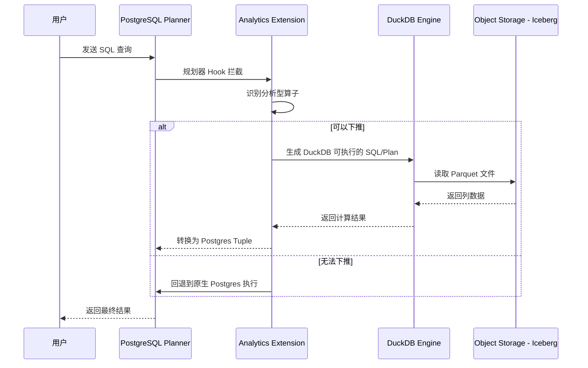
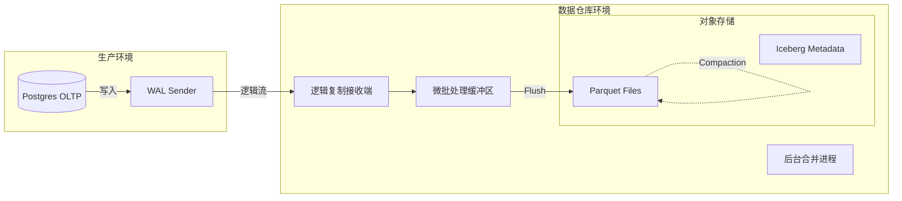

## Table of contents

# PostgreSQL 数据仓库架构指南

> **基于 Marco Slot (Crunchy Data) 在 POSETTE 2025 的演讲总结**

本文档介绍了一种利用 PostgreSQL 扩展性构建现代数据仓库的架构方案。该方案结合了 **DuckDB** 的计算能力和 **Apache Iceberg** 的存储优势，旨在解决 PostgreSQL 原生行式存储在分析型工作负载（OLAP）下的性能瓶颈。

## 1. 核心理念

传统的 OLTP 数据库与 OLAP 数据仓库在设计上存在本质差异：

| **特性**     | **OLTP (原生 Postgres)** | **OLAP (目标架构)**       |
| ------------------ | ------------------------------ | ------------------------------- |
| **存储格式** | 行式 (Row-oriented)            | 列式 (Column-oriented, Parquet) |
| **执行模型** | 逐行处理 (Tuple-at-a-time)     | 向量化执行 (Vectorized)         |
| **IO 模式**  | 随机读写，依赖 Buffer Cache    | 顺序扫描，依赖高吞吐量          |
| **适用场景** | 高并发事务，CRUD               | 复杂报表，聚合分析              |

 **解决方案** ：保持 PostgreSQL 作为前端接口（处理 SQL 解析、事务管理、Catalog），但将繁重的分析计算卸载给嵌入式引擎 DuckDB，并将冷数据存储在低成本的对象存储中。

## 2. 系统架构

### 2.1 架构组件

* **PostgreSQL** : 作为统一入口，负责元数据管理（Catalog）、事务控制和查询路由。
* **DuckDB** : 嵌入在 Postgres 进程中的向量化执行引擎，负责读取 Parquet 文件并执行高强度的计算。
* **Apache Iceberg** : 表格式标准，存储在 S3/Azure Blob 等对象存储上，支持 ACID 事务。

### 2.2 混合查询执行流程

当用户发起查询时，Postgres 的查询规划器会被 Hook 拦截：



## 3. 关键工作流实践

### 3.1 场景一：Zero-ETL 日志分析

无需复杂的 ETL 管道，直接将对象存储中的日志文件加载到 Postgres 可查询的 Iceberg 表中。

* **工具** : `pg_incremental` 扩展
* **流程** : 定期扫描 Bucket -> 发现新文件 -> 事务性导入 Iceberg -> 自动去重/处理。

```sql
-- 伪代码示例：创建一个指向 S3 日志的外部表
CREATE TABLE app_logs_raw (
    timestamp timestamptz,
    level text,
    message text
) SERVER parquet_s3_server
OPTIONS (filename 's3://my-bucket/logs/*.json');

-- 转换为 Iceberg 表以获得高性能查询
CALL synchronize_logs('app_logs_raw', 'app_logs_iceberg');
```

### 3.2 场景二：从生产库实时同步 (Logical Replication)

将生产环境的 Operational Database 实时同步到数据仓库，实现近实时的分析。

* **源端** : 普通 PostgreSQL，创建 Publication。
* **目标端** : 数据仓库 Postgres，创建 Subscription。



## 4. 性能与优势

1. **查询速度** : 在 ClickBench 和 TPC-H 测试中，相比原生 Postgres 表，分析查询性能提升  **10x - 100x** 。
2. **存储成本** : Iceberg + Parquet 压缩率极高，且存储在廉价的对象存储上，远低于本地 SSD 成本。
3. **生态兼容** :

* **Spark/Trino** : 可以直接读取底层 Iceberg 数据，无需经过 Postgres。
* **Postgres 工具** : 兼容 psql, pgAdmin, 以及现有的 BI 工具（Tableau, PowerBI）。

## 5. 总结

该架构实际上实现了一个  **PostgreSQL-native Lakehouse** 。它不需要引入全新的大数据组件（如 Hadoop 或独立的 Spark 集群），而是通过扩展（Extensions）的方式，赋予了 PostgreSQL 处理 PB 级数据的能力。

* **适合场景** : SaaS 应用内的分析、日志归档与查询、从主库卸载报表负载。
* **不适合场景** : 亚毫秒级的点查询（Point Lookups），高频单行更新。
