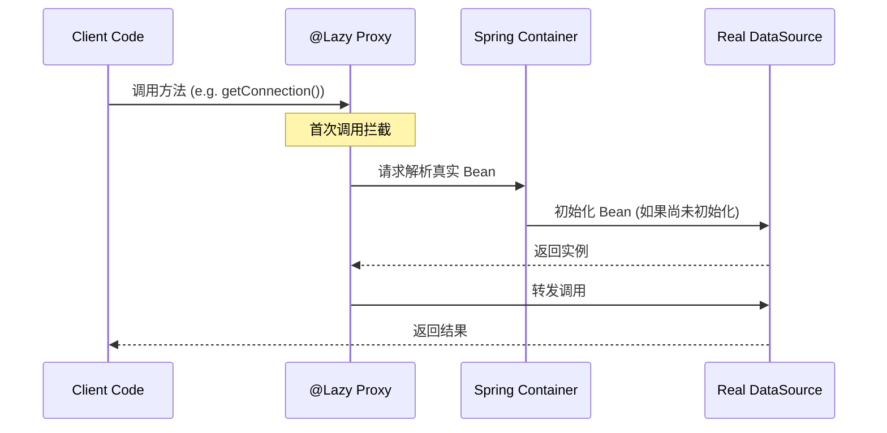
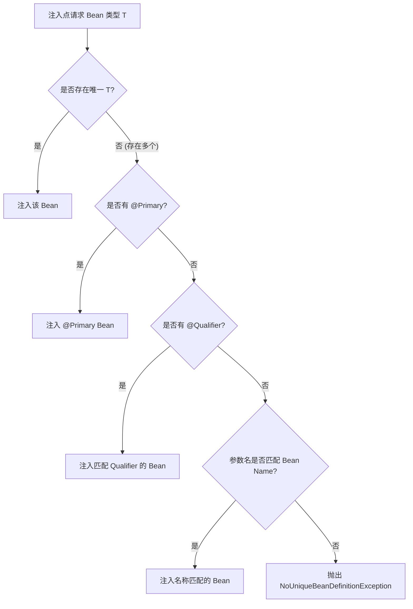

本文档深入探讨了 Spring 核心容器（Core Container）中**注入点（Injection Points）**和**Bean 定义（Bean Definitions）**的工作原理。我们将从现代 Spring (6.2) 的最佳实践出发，并展望 Spring 7.0 中引入的函数式注册机制。

## Table of contents

## 1. 注入点 (Injection Points) 及其变体

在 Spring 中，构造函数或工厂方法的参数被称为“注入点”。

### 1.1 标准注入与隐式行为

默认情况下，当你在构造函数中声明一个参数时，Spring 容器会假设你需要一个**完全初始化**的 Bean。

**代码示例：**

```java
@Service
public class UserRepository {
    private final DataSource dataSource;

    // Spring 4.3+ 以后，单构造函数无需 @Autowired
    public UserRepository(DataSource dataSource) {
        this.dataSource = dataSource;
    }
}
```

### 1.2 延迟注入 (`@Lazy`)

如果在构造函数参数（即注入点）上使用 `@Lazy`，容器的行为会发生显著变化。容器不会立即注入目标 Bean，而是注入一个 **代理（Proxy）** 。

* **适用场景** ：解决循环依赖、优化启动时间（如果该 Bean 很大且不一定立即用到）。
* **原理** ：只有在代码实际调用 `dataSource` 的方法时，代理才会去解析并触发真实 Bean 的初始化。



**代码示例：**

```java
@Component
public class ReportService {
    private final DataSource dataSource;

    // 注入的是一个代理，此时 DataSource 可能尚未初始化
    public ReportService(@Lazy DataSource dataSource) {
        this.dataSource = dataSource;
    }
  
    public void generate() {
        // 只有在这里真正调用时，DataSource 才会被解析
        this.dataSource.getConnection(); 
    }
}
```

### 1.3 可空性与 Optional

默认情况下，注入点是强制依赖（Mandatory）。如果找不到 Bean，应用启动会失败。可以通过以下方式声明可选依赖：

1. **`@Nullable` 注解** ：注入 `null`。
2. **`Optional<T>`** ：注入 `Optional.empty()`。

**代码示例：**

```java
@Component
public class NotificationService {

    private final SmsProvider smsProvider;

    public NotificationService(@Nullable SmsProvider smsProvider) {
        // 如果容器中没有 SmsProvider，这里为 null
        this.smsProvider = smsProvider;
    }

    // 或者使用 Optional (推荐)
    public NotificationService(Optional<EmailProvider> emailProvider) {
        emailProvider.ifPresent(provider -> provider.send("Hello"));
    }
}
```

## 2. ObjectProvider：编程式注入句柄

Juergen 强烈推荐使用 `ObjectProvider<T>`。它是一个强大的句柄，允许你在**不使用代理**的情况下实现延迟加载、条件判断和流式处理。

### 2.1 核心特性

* **延迟获取 (`getObject`)** ：类似 `@Lazy`，但没有代理开销。
* **安全获取 (`getIfAvailable`)** ：类似 `@Nullable`。
* **流式处理 (`stream`)** ：遍历容器中所有匹配类型的 Bean。

### 2.2 实战示例

假设我们有一个插件系统，系统中有多个 `Plugin` 实现，我们需要根据情况加载。

```java
@Service
public class PluginManager {

    private final ObjectProvider<Plugin> pluginProvider;

    // 注入 ObjectProvider，此时不会实例化任何 Plugin
    public PluginManager(ObjectProvider<Plugin> pluginProvider) {
        this.pluginProvider = pluginProvider;
    }

    public void runPlugin(String qualifier) {
        // 1. 延迟获取单个 Bean
        // 如果存在且唯一，返回实例；否则抛出异常
        Plugin p = pluginProvider.getObject();
      
        // 2. 安全获取（类似 @Nullable）
        Plugin safeP = pluginProvider.getIfAvailable(() -> new DefaultPlugin());
    }

    public void runAllPlugins() {
        // 3. 流式处理 (延迟迭代)
        // 只有在迭代发生时，具体的 Plugin Bean 才会被初始化
        pluginProvider.stream()
            .filter(Plugin::isEnabled)
            .forEach(Plugin::execute);
    }
}
```

### 2.3 结合限定符 (`@Qualifier`)

`ObjectProvider` 本身是基于类型的，但它支持注入点上的限定符。

```java
public class MyService {
    // 获取所有带有 @MyCustomQualifier 注解的 DataSource
    public MyService(@MyCustomQualifier ObjectProvider<DataSource> dataSources) {
        dataSources.stream().forEach(ds -> { /* ... */ });
    }
}
```

## 3. Bean 定义与消歧义 (Bean Definitions)

### 3.1 最佳实践：如何处理多个同类型 Bean

当容器中存在多个同类型的 Bean（例如多个 `DataSource`）时，Juergen 建议按以下优先级处理：

1. **`@Primary` (推荐)** ：将其中一个标记为主 Bean。在单值注入点，容器会自动选择它。
2. **Bean 名称匹配 (参数名)** ：Spring 6.2 优化了这一点。如果参数名（如 `myDataSource`）与 Bean 的名称完全一致，容器会优先选择该 Bean，且无需额外的元数据解析，性能更优。
3. **`@Qualifier`** ：显式指定名称。

**Bean 定义流程图：**



## 4. Spring 7.0 新特性：Bean Registrars

在 Spring 7.0 中，为了解决 `@Configuration` 类过于静态且难以处理复杂动态注册逻辑的问题，引入了 `BeanRegistrar`。

### 4.1 对比 `@Configuration` 与 `BeanRegistrar`

| **特性**     | **@Configuration + @Bean** | **BeanRegistrar (Spring 7.0)**     |
| ------------------ | -------------------------------- | ---------------------------------------- |
| **风格**     | 声明式 (Declarative)             | 编程式/函数式 (Functional)               |
| **控制流**   | 受限 (基本只能写简单的工厂逻辑)  | **完全灵活**(支持 if/for 循环注册) |
| **AOT 支持** | 支持                             | **原生支持 (AOT Friendly)**        |
| **适用场景** | 通用业务 Bean                    | 基础设施、动态配置、库开发               |

### 4.2 代码示例：基于条件的动态注册

假设我们需要根据一个配置文件的内容，动态注册若干个 DataSource，并且根据标志位决定是否注册监控 Bean。这在 `@Configuration` 中很难优雅实现。

```java
// Spring 7.0 风格的 BeanRegistrar
public class DatabaseRegistrar implements BeanRegistrar {

    @Override
    public void register(BeanRegistry registry, Environment env) {
      
        // 1. 可以使用普通的 Java 逻辑 (if, for)
        boolean statsEnabled = env.getProperty("db.stats.enabled", Boolean.class, false);

        // 2. 动态注册 Bean
        registry.registerBean("mainDataSource", DataSource.class)
                .specialize(bean -> bean
                    .primary() // 设置为 Primary
                    .properties(props -> props.add("url", "jdbc:h2:..."))
                );

        // 3. 基于逻辑的条件注册
        if (statsEnabled) {
            registry.registerBean("dbStatistics", DbStatistics.class)
                    .specialize(bean -> bean
                        // 使用 Supplier 构造，传入引用
                        .instanceSupplier(() -> new DbStatistics(registry.getBean("mainDataSource")))
                    );
        }
    }
}
```

### 4.3 使用方式

`BeanRegistrar` 可以被导入到主配置类中：

```java
@Configuration
@Import(DatabaseRegistrar.class) // 像导入配置类一样导入 Registrar
public class AppConfig {
    // ...
}
```

## 5. 总结

1. **注入点** ：不仅是获取依赖，更是与容器沟通意图的契约（是否延迟、是否必须）。
2. **`ObjectProvider`** ：是处理可选性、延迟加载和集合注入的瑞士军刀，比直接使用 `@Autowired` List 更强大。
3. **Spring 7.0** ：`BeanRegistrar` 为基础设施代码提供了强大的编程式配置能力，弥补了 `@Configuration` 在动态性上的不足，同时保持了对 AOT 的友好支持。
